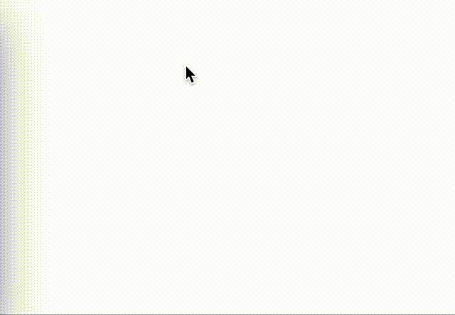
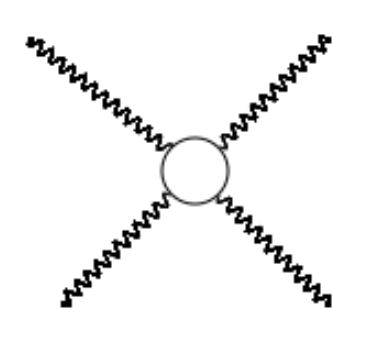
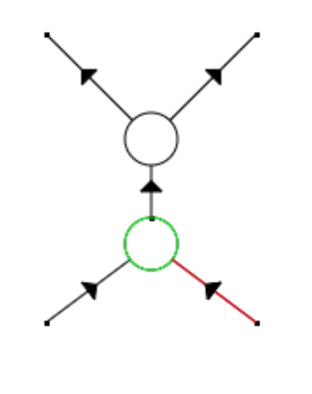

# RDFeynmann

This is a Feynmann Diagram editor.

# Usage

Open main.html in your browser.

# Operation Rule

v: Add point

p: Add Propagator

l: Add Loop

/: String Mode In/Out

t: allow direction change

q: line style change

c: select reverse

@: remove arrow

click: select (red)

double click: sub select (green)

n: next select (red)

b: pre select (green)

s: next sub select (red)

a: pre sub select (green)

z: no select mode In/Out

8: up select target

6: right select target

4: left select target

2: down select target

w: scale up

x: scale down

# LICENSE
MIT